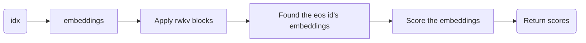
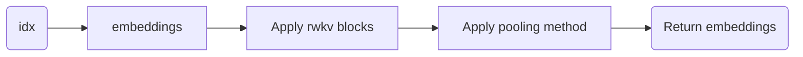

# RWKV_LM_EXT
This project is to extend RWKV LM's capabilities including sequence classification/embedding/peft/cross encoder/bi encoder/multi modalities, etc.

## src/model_ext.py

We extends two types of model based on RWKV(5,6)。

- RwkvForClassification

This class is used to do sequence classification.

- RwkvForSequenceEmbedding

This class is used to do sequence embedding.
