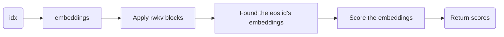
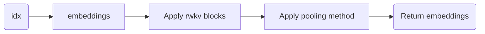

# RWKV_LM_EXT
This project is to extend RWKV LM's capabilities including sequence classification/embedding/peft/cross encoder/bi encoder/multi modalities, etc.

## src/model_ext.py

We extends two types of model based on RWKV(5,6)。

- RwkvForClassification

This class is used to do sequence classification.

- RwkvForSequenceEmbedding

This class is used to do sequence embedding.

## Some lora checkpoints:

AnswerBot SFT: 链接: https://pan.baidu.com/s/1f61FwhinoGqWg-nlAWPnPw?pwd=b4ff 提取码: b4ff 
--来自百度网盘超级会员v6的分享

This is finetuned by RWKV's lora.

BiEncoder: 链接: https://pan.baidu.com/s/1f61FwhinoGqWg-nlAWPnPw?pwd=b4ff 提取码: b4ff 
--来自百度网盘超级会员v6的分享

This is finetuned by peft.

The usage of these two peft, please refer to src/layers.py main entry. Try python src/layers.py test_both to see the magic!

Further more some utilities:

 - peft_train/hf2rwkv_lora.py  convert the lora check point trained by huggingface peft to rwkv lora format. This utility can be used to TURN BiEncoder checkpoint.

 - peft_train/peft_test.py is a better example to show how to use one base model to do variable stuffs in runtime by switching lora adapters only.