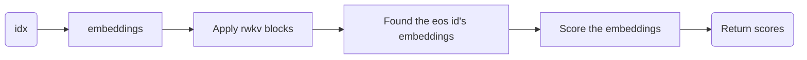

# RWKV_LM_EXT
This project is to extend RWKV LM's capabilities including sequence classification/embedding/peft/cross encoder/bi encoder/multi modalities, etc.


## src/model_ext.py

We extends two types of model based on RWKV(5,6)。

- RwkvForClassification

This class is used to do sequence classification.


- RwkvForSequenceEmbedding

This class is used to do sequence embedding.


## Some lora checkpoints:

- AnswerBot SFT:
  - 链接: https://pan.baidu.com/s/1f61FwhinoGqWg-nlAWPnPw?pwd=b4ff 提取码: b4ff 
--来自百度网盘超级会员v6的分享

  This is finetuned by RWKV's lora.
  - Huggingface: https://huggingface.co/yueyulin/rwkv_peft_sft_lora

- AnswerBot SFT-Pissa Rank64
  - This is a pissa fine tuned with rank 64: https://huggingface.co/yueyulin/tigerbot_chat_sft_pissa_r64

- AnswerBot PISSA SFT: 
  - 链接: https://pan.baidu.com/s/1T_bv_aF_6f7lVJTJeRB3Eg?pwd=6b6c 提取码: 6b6c --来自百度网盘超级会员v6的分享

  - Huggingface: https://huggingface.co/yueyulin/rwkv_peft_pissa_tigerbot

- BiEncoder: 

  - 链接: https://pan.baidu.com/s/1f61FwhinoGqWg-nlAWPnPw?pwd=b4ff 提取码: b4ff --来自百度网盘超级会员v6的分享
  - Huggingface:https://huggingface.co/yueyulin/rwkv_sft_bi_encoder/

   There are two files in epoch_1_step_430000:
    - RWKV-x060-World-1B6-v2.1-20240328-ctx4096.pth.pth is trained and saved by huggingface peft injection model.
    - RWKV-x060-World-1B6-v2_rwkv_lora.pth is converted by peft_train/hf2rwkv_lora.py utility. 


Try python peft_train/peft_test.py to see how both 2 sft work seemlessly. In the future more sft parameters can work together to build a more sophiscated AI assistant.


Further more some utilities:

 - peft_train/hf2rwkv_lora.py  convert the lora check point trained by huggingface peft to rwkv lora format. This utility can be used to TURN BiEncoder checkpoint.

 - peft_train/peft_test.py is a better example to show how to use one base model to do variable stuffs in runtime by switching lora adapters only.

    . if you're using PISSA checkpoint, please set --chat_lora_alpha 8 instead --chat_lora_alpha 32 in Lora.

## Training process to do a SFT using RWKV's lora/pissa/state tuning.
- Download the base model from: https://huggingface.co/BlinkDL/rwkv-6-world , here we download the RWKV-x060-World-1B6-v2.1-20240328-ctx4096.pth model, save it to dir MODEL_DIR
- Download datasets from : https://huggingface.co/datasets/yueyulin/answering_bot , save them to JSON_DIR
- Preprocess the json files to variable sized datasets. The tokenizer file is in tokenizer/directory, please adjust the parameters according your real situation.
```python
python data/SftUtilities.py --input_dir JSON_DIR --output_dir DATASET_DIR --tokenizer_file PATH_TO_rwkv_vocab_v20230424.txt
```
- We got datasets in DATASET_DIR, now we can train our SFT model. The following's are the script we use to train lora/pissa/state tuning. Let's assume we output our SFT peft model to OUTPUT_DIR. For a 4090ti, we can train the data with batch 32 16 8 4 2 1 corresponding to 64 128 256 512 1024 2048 max length.
 
  - Lora
  ```python
  RWKV_TRAIN_TYPE=lora python peft_train/peft_train_sft.py --train_data /home/rwkv/data/tigerbot_sft_dataset --model_file MODEL_DIR/RWKV-x060-World-1B6-v2.1-20240328-ctx4096.pth --output_dir OUTPUT_DIR/lora_rwkv --train_type lora --log_every_n_steps 100000 --target_modules att ffn --log_every_n_steps 100000 --wandb lora_tigerbots --num_epochs 3 --train_lengths 64 128 256 512 1024 2048 --train_batch_sizes 32 16 8 4 2 1
  ```

  - Pissa
  ```
  RWKV_TRAIN_TYPE=pissa python peft_train/peft_train_sft.py --train_data /home/rwkv/data/tigerbot_sft_dataset --model_file MODEL_DIR/RWKV-x060-World-1B6-v2.1-20240328-ctx4096.pth --output_dir OUTPUT_DIR/pissa_rwkv --train_type pissa --log_every_n_steps 100000 --target_modules att ffn --log_every_n_steps 100000 --wandb pissa_tigerbots --num_epochs 3 --train_lengths 64 128 256 512 1024 2048 --train_batch_sizes 32 16 8 4 2 1
  ```

## Beam search  with logits processors

Now user can use beam search to get variable results with beam search. Try src/tests/TestBeamSearch.py. 

