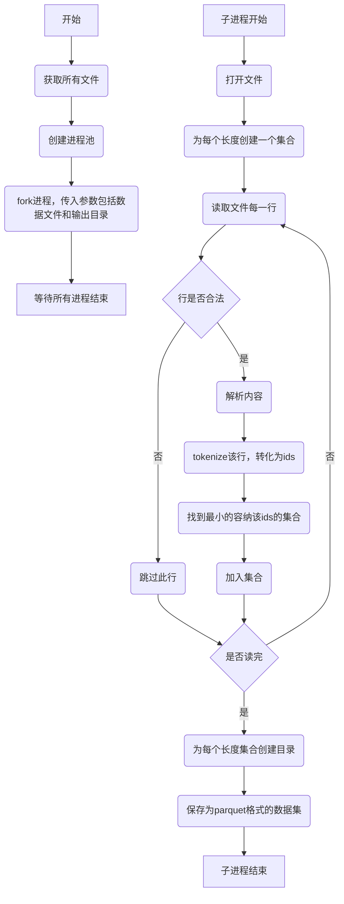

# 可变length数据集设计

可变数据集设计是按照长度对数据进行切分，在训练的时候，把不同数据集读取出来训练，根据不同长度自动调整batch_size。可在保证数据长度多样性的情况下，保证显存使用稳定。

## 预处理过程

假设我们的原始数据保存在DATA_DIR下面，且被切分成N个文件，文件以jsonl方式存储。流程图如下：

## 训练时候使用可变长度数据集

我们通过自定义的FixedLenDataset和MyBatchSampler在一个DataLoader中，使用不同长度数据进行训练。

### FixedLenDataset

这是一个简单的Dataset实现，每次返回数据，都增加一个fixed_len表明当前数据来自哪个长度的数据集。

### MyBatchSampler

我们保存所有Dataset的目录为DS_DIR，每个目录名的后缀代表了该数据集的长度。如：xxx_128代表该数据集下面的数据最长长度为128。

读取DS_DIR目录下的所有子目录，并且按照长度把后缀一样的数据集连接成一个数据集。最后按照长度组装成一个数据集List返回。

MyBatchSampler创建的时候，传入数据集List，对应该List长度的batch长度。如传入的数据集有两个[DS_128,DS_256],则batch长度List为[128,64]，即DS_128一个batch包含128条数据，DS_256包含64条数据。 world_size，训练worker的个数，rank为当前worker的id，让每个worker可以用不同数据进行训练。
当