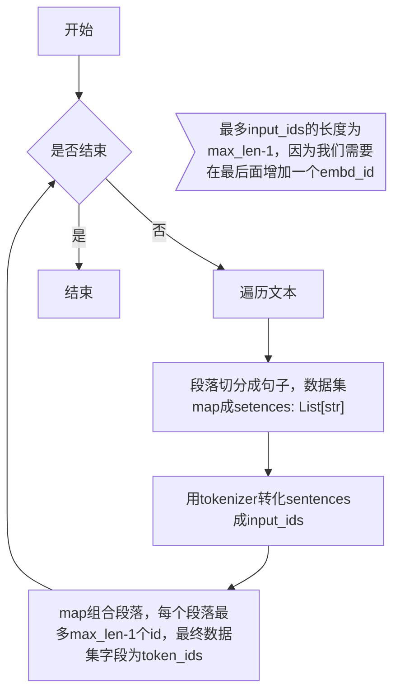
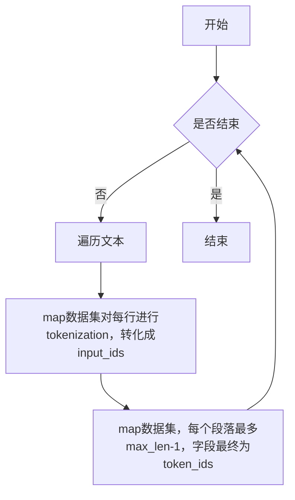
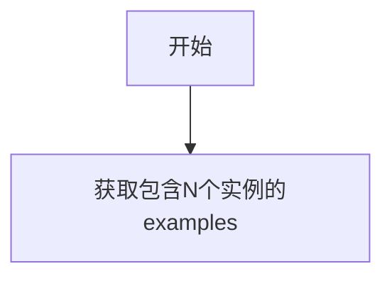

## Preprocess

For wiki dataset

```mermaid
graph TD;
    A[开始]-->C{是否结束};
    C-->|否|B[遍历文本];
    B-->D["段落切分成句子，数据集map成setences: List[str]"];
    D-->E["用tokenizer转化sentences成input_ids"];
    noteofE>"最多input_ids的长度为max_len-1，因为我们需要在最后面增加一个embd_id"]
    noteofE ~~~ B
    E-->F["map组合段落，每个段落最多max_len-1个id，最终数据集字段为token_ids"]
    F-->C
    C-->|是|结束

```

For book dataset

```mermaid
graph TD
A[开始]-->B{是否结束}
B-->|否|C[遍历文本]
C-->D["map数据集对每行进行tokenization，转化成input_ids"]
D-->E["map数据集，每个段落最多max_len-1，字段最终为token_ids"]
E-->B
B-->|是|结束
```

## Data collator

```mermaid
graph TD
    A[开始]-->B[获取包含N个实例的examples]
    
```